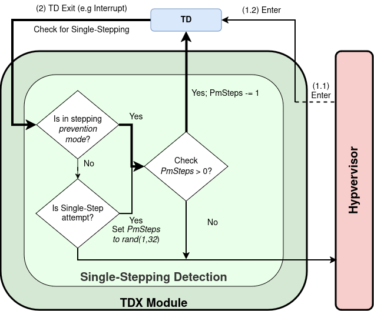
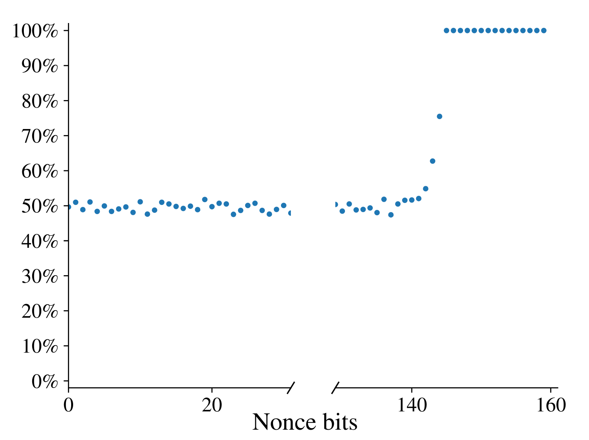
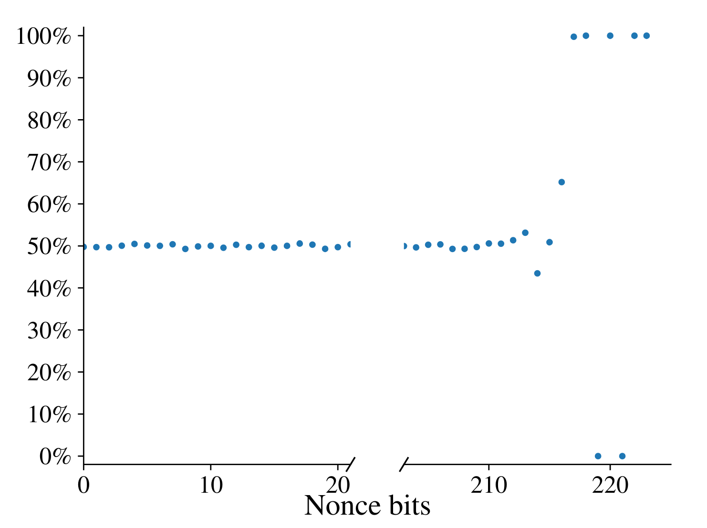

# TDXdown: Single-Stepping and Instruction Counting Attacks against Intel TDX

Trusted Execution Environments (TEEs) are the most promising techology for protecting code and data in the cloud.
Their objective is to isolate an application or virtual machine from the OS and any other software running on the same physical system.
Single-Stepping attacks are a very prominent class of attacks against TEEs that are enabled by the strong attacker model.
They allow an attacker to observe the execution of a TEE instruction-by-instruction and have lead to a long line of devastating attacks against Intel SGX and more recently also AMD SEV.

Thus, Intel's newest, VM-scoped TEE, Intel Trust Domain Extensions (TDX), comes with a built-in single-stepping countermeasure to thwart this class of attacks from the get-go.
The countermeasure uses a heuristic to detect a potential single-stepping attempt and subsequently activates a prevention mode to mitigate the attack.

In TDXdown we show a flaw in both, the single-stepping detection heuristic and prevention mode.
The flaw in the heuristic allows an attacker to circumvent the activation of the prevention mode altogether, re-enabling single-stepping on TDs.
Furthermore, we show **StumbleStepping**, an inherent flaw in the prevention mode, that allows fine-grained leakage of the number of instructions executed by the TD.

Finally, we conduct a systematic analysis of the ECDSA nonce truncation implementation, revealing subtle control-flow leakages in wolfSSL and OpenSSL.
In contrast to previous work which classified this leakage as negligible, our analysis shows that up to 16 most significant bits of the private ECDSA nonce are leaked.
Using our two attack primitives, we show end-to-end attacks against both libraries and reconstruct ECDSA private keys.


## Single-Stepping Countermeasure

The following figure shows an overview of the TDX single-stepping countermeasure which splits into the detection heuristic and the prevention mode (PM):

<center>
    
</center>


Initially, the *stepping prevention mode* is not active.
The hypervisor starts the TD by calling the TDX module (1.1) which in turn enters the TD (1.2).
When the TD exits (2), the TDX module
applies a heuristic to check for single-stepping.
To this end, it checks if at least two instructions have been executed **OR** if "sufficient time" has passed since the last TD exit, which is defined as 4096 CPU cycles.
For the latter, the TDX module takes a `rdtsc` timestamp before entering and after exiting the TD.
If none of the two conditions is true, the TDX module activates the prevention mode and re-enters the TD for a randomized number of times (*PmSteps*), before disabling the prevention mode, as indicated by the circle in the top left part.
On each entry, a special configuration is used to ensure that the TD only executes a single instruction.

## Single-Stepping Attack Primitive

For the single-stepping attack, we exploit that the `rdtsc` timer used in the timing check of the heuristic, executes at a frequency that is independent of the current CPU frequency.
We combine this `rdtsc` behavior with the malicious hypervisor's ability to configure the operating frequency of the core on which the TDX module and the TD are running.
Using a constant frequency for `rdtsc` implies that the demanded 4096 timestamp counter increments always take the same wall clock time.
Meanwhile, lowering the frequency of the victim core slows down its execution speed.
By setting the frequency low enough, entering the TD, executing one instruction and leaving the TD already takes more than 4096 timestamp counter increments.
Consequently, with the modified CPU frequency in place, we are able to use the APIC timer to interrupt the TD after every instruction while still ensuring that the TDX module measures at least 4096 cycles and thus does not trigger the single-stepping prevention.

With the countermeasure out of the way, we are able to reliably single-step the TD.
For zero step filtering, we use a cache attack against the instruction cache since neither the previously used Access bit based method (SGX-Step) nor performance counter monitoring (SEV-Step) work with TDX.

## Stumble-Stepping Attack Primitive

For this attack we exploit that every time the *stepping prevention mode* re-enters the TD, the context switch between TDX module and TD leaves a footprint in the cache.
By running a cache attack in parallel to the execution of the *stepping prevention mode*, we are able to infer the number of times it re-enters the TD and thus the number of instructions executed by the TD.
While weaker than single-stepping, *StumbleStepping* still allows exploiting subtle non-constant time behavior, as demonstrated by our end-to-end attack against wolfSSL.

## End-to-End Attacks

We demonstrate that both, single-stepping TDs as well as counting their instructions with *StumbleStepping* allows to exploit control-flow leakages with deviations of only very few instructions.

We found that differentiating between specific control-flow events during the truncation process of the secret ECDSA nonce reveals substational information about the most significant bits of this nonce. The amount of leaked bits depends on the curve.
Especially, for the secp160 curve (15 bit) and certain brainpool curves (up to 7 bit) the leakage is well exploitable, allowing us to reconstruct the ECDSA private key.
This again emphasizes the need for thorough constant-time implementations.


<!--|  |  |
|--------------------------------------|---------------------------------------|
|Leakage for secp160r1|Leakage for brainpoolp224r1|-->

<div style="display: flex; flex-wrap: wrap; max-width: 1024px;">
    <div style="flex-basis: 50%; min-width: 400px;">
    <figure>
        
        <figcaption><center>Leakage for secp160r1</center></figcaption>
    </figure>
    </div>
    <div style="flex-basis: 50%; min-width: 400px;">
    <figure>
        
        <figcaption><center>Leakage for brainpoolp224r1</center></figcaption>
    </figure>
    </div>
</div>


Using single-stepping and *StumbleStepping* we capture the relevant control-flow events and record the corresponding ECDSA signatures to reconstruct the private key.

# Questions & Answers

## What is Intel TDX and how does it work?

TDX is Intel's most recent virtual machine-scoped Trusted Execution Environment.
The goal of TDX is to enable customers to rent VMs in the cloud without having to trust the cloud service provider.
Thus, TEEs like TDX are a promising solution to enable processing of private or sensitive data in the cloud and can help to adhere to privacy regulations like the GDPR.

On a technical level, TDX implements its security guarantees via two mechanisms.
Before storing data to RAM, TDX encrypts it using AES-XTS to mitigate physical attacks on the DRAM.
While processed inside the CPU, the data is stored in plaintext.
However, logical isolation through additional access right-based mechanisms and resource tagging prevent software-level attackers from accessing the data, even if they can modify the BIOS or execute code in kernel space.

## Which platforms are affected?

We tested our attacks on both 4th generation and 5th generation Intel Xeon Scalable Processors which, at the time of writing, are the only CPU generations with TDX support.
For the former, only select cloud customers were provided with a TDX enabled version while for the latter also commercially available CPUs feature TDX.

As a consumer, you are only affected if you are currently renting a TDX protected VM in the cloud.

## Which capabilities does the attacker require?

We assume a system level attacker with local access, e.g. via SSH. The attacker has full systems privileges. Via the Intelligent Platform Management Interface (IPMI) the attacker has read and write access to the UEFI / BIOS. This is in line with the [TDX attacker model](https://cdrdv2-public.intel.com/690419/TDX-Whitepaper-February2022.pdf) and the default TEE threat model.

Examples for such an attacker are the cloud service provider itself, a state level agency (e.g. secret services) or well funded hackers which obtain system level access to machines that host TDs or other enclaves protected by a TEE.

We disagree with the statement from the BSI (German Federal Office for Information Security) in an article on [heise.de](https://www.heise.de/news/Forscher-entdecken-Schwachstellen-in-Intels-Trust-Domain-Extensions-9974224.html), claiming that our attack would require physical access.

## Are there countermeasures?

Intel has developed a mitigation to the single-stepping attack that is part of the TDX module version 1.5.06.
As you read this, the secured version is already available.
Intel will not provide countermeasures against *StumbleStepping* and instead refers developers to follow their [Software Security Guidance information](https://www.intel.com/content/www/us/en/developer/topic-technology/software-security-guidance/best-practices.html) to make sure that their applications do not leak any secrets via their control flow.

OpenSSL and wolfSSL both addressed the reported issues in the ECDSA nonce generation with software updates.

## I want to know more

The work will be presented at the upcoming ACM Conference on Computer and Communications Security (CCS) 2024 on October 15 in Salt Lake City, Utah. Please join us for the presentation or find more details in the [paper](tdxdown_preprint.pdf).

## Responsible Disclosure

We reported our initial findings to Intel on October 11th, 2023.
Using our proof of concept code, Intel reproduced the attacks and issued CVE 2024-27457.
We agreed on an embargo until October 8th, 2024.
Intel has mitigated the vulnerability in the single-stepping heuristic starting with TDX module version 1.5.06.
However, they will not provide countermeasures against **StumbleStepping** and instead refer to their [Software Security Guidance information](https://www.intel.com/content/www/us/en/developer/topic-technology/software-security-guidance/best-practices.html) to solve this issue on the application level.
You can find Intel's security anouncement [here](https://www.intel.com/content/www/us/en/security-center/announcement/intel-security-announcement-2024-10-08-001.html).

We disclosed the respective nonce truncation leakages to both wolfSSL and OpenSSL. WolfSSL allocated CVE 2024-1544 and added an additional constant-time implementation in version 5.6.6.
OpenSSL does not assign CVEs for “same physical system side-channels” but released a fix for the secret dependent control-flow in their nonce truncation. The fix is included from version 3.3.1.
Both libraries use rejection sampling for their fixes.

## Should I still use TEEs at all?

For sensitive computations or computations on sensitive data executed in the cloud or generally someone else's computer, we recommend the usage of Trusted Execution Environments. While TEEs are not a perfect solution and, as we show, still allow attackers to obtain insights via e.g. side-channel or controlled-channel attacks, they provide a substantial increase in security. They isolate the application or VM from the host operating system and other software as well as co-located customers and the cloud provider itself. Moreover, they can also be used to reduce the trusted computing base, meaning the software components that have to be trusted.

Without TEEs the cloud provider can inspect your application at any time and with substantially less effort and expertise than required for our attacks. Co-located customers or software also has an easier time extracting data from your computations. Moreover, encrypting data at rest does not protect the data at runtime.


However, TEEs still require the protected software to adhere to certain principles, to mitigate shortcomings of the TEE.
To this end,
developers should follow implementation guidelines provided by the TEE provider such as [Intel's Security Guidance for TD Developers](https://www.intel.com/content/www/us/en/developer/topic-technology/software-security-guidance/best-practices.html) and stay up-to-date on recent research results and security advisories for their used technology.


# Cite


```bibtex
@INPROCEEDINGS{tdxdownCCS24,
  author    = {Luca Wilke and Florian Sieck and Thomas Eisenbarth},
  booktitle = {Proceedings of the 2024 ACM SIGSAC Conference
                on Computer and Communications Security, {CCS} 2024,
                Salt Lake City, UT, USA, October 14--18, 2024},
  title     = {{TDXdown}: Single-Stepping and Instruction Counting Attacks
                against Intel {TDX}},
  year      = {2024},
  doi       = {10.1145/3658644.3690230}
}
```

